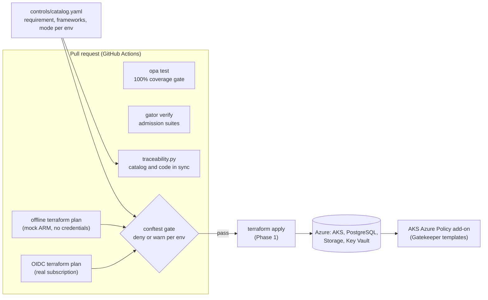

# ledger-guardrails

Security requirements for a payment platform on Azure, written once as controls and enforced as code at every stage: pull request, cluster admission, and (later phases) Azure Policy and runtime scanning.

Ledger is a simulated payment-processing workload: AKS, PostgreSQL Flexible Server, Storage and Key Vault in `germanywestcentral`. It has to satisfy ISO 27001, SOC 2 and the CIS Azure benchmark. This repository turns those requirements into policies that block non-compliant changes before they reach Azure, and it proves every policy with tests.

## What a blocked pull request looks like

This is real output. [`examples/noncompliant`](examples/noncompliant/main.tf) is a typical "quick fix" PR: SSH opened for debugging, a public storage account holding payment data, a purgeable Key Vault, and a resource group with missing tags. CI runs `terraform plan` on it and evaluates the plan (conftest's file and namespace prefix trimmed for width):

```text
FAIL - [LG-DATA-01] azurerm_storage_account.export: data-class "payment" requires an inline customer_managed_key block
FAIL - [LG-DATA-02] azurerm_storage_account.export: allow_nested_items_to_be_public must be false (no anonymous blob access)
FAIL - [LG-DATA-02] azurerm_storage_account.export: public_network_access must be "Disabled"; expose the account through a private endpoint
FAIL - [LG-DATA-02] azurerm_storage_account.export: shared_access_key_enabled must be false; use Entra ID authentication
FAIL - [LG-GOV-01] azurerm_resource_group.hotfix: missing required tags ["cost-center", "data-class"]
FAIL - [LG-KEY-01] azurerm_key_vault.hotfix: public_network_access_enabled must be set explicitly to false
FAIL - [LG-KEY-01] azurerm_key_vault.hotfix: purge_protection_enabled must be true
FAIL - [LG-KEY-01] azurerm_key_vault.hotfix: soft_delete_retention_days must be 90
FAIL - [LG-NET-01] azurerm_network_security_group.debug: inline rule "allow-ssh-debug" allows port 22 from the internet

10 tests, 1 passed, 0 warnings, 9 failures, 0 exceptions
```

The compliant sandbox stack in [`infra/envs/sandbox`](infra/envs/sandbox) passes in `sandbox` with one deliberate warning, and the same finding blocks in `prod`:

```text
$ make gate ENV=sandbox
WARN - [LG-BCP-01] azurerm_postgresql_flexible_server.ledger: data-class "payment" requires geo_redundant_backup_enabled = true

$ make gate ENV=prod
FAIL - [LG-BCP-01] azurerm_postgresql_flexible_server.ledger: data-class "payment" requires geo_redundant_backup_enabled = true
```

Every message starts with the control ID, so a developer can go straight from a failed check to the requirement it enforces.

## Control matrix

Generated from [`controls/catalog.yaml`](controls/catalog.yaml) by `make matrix`. CI fails if this table, the catalog and the policy code disagree.

<!-- control-matrix:start -->
| Control | Objective | ISO 27001:2022 | SOC 2 | PR gate (Rego) | Admission (AKS) | Mode: sandbox | Mode: prod |
|---|---|---|---|---|---|---|---|
| `LG-BCP-01` | Payment databases have geo-redundant backups | A.8.13, A.5.30 | A1.2 | `postgres.rego` | - | warn | enforce |
| `LG-BCP-02` | Protected resources are not destroyed without an approved exemption | A.8.13, A.8.32 | CC8.1, A1.2 | `protection.rego` | - | warn | enforce |
| `LG-DATA-01` | Sensitive data encrypted at rest with customer-managed keys | A.8.24 | CC6.1 | `storage.rego`, `postgres.rego` | - | enforce | enforce |
| `LG-DATA-02` | Storage reachable only privately, over TLS 1.2+, with Entra ID auth | A.5.15, A.8.20, A.8.24 | CC6.1, CC6.6, CC6.7 | `storage.rego` | - | enforce | enforce |
| `LG-DB-01` | PostgreSQL private and Entra ID only | A.8.5, A.8.20 | CC6.1, CC6.6 | `postgres.rego` | - | enforce | enforce |
| `LG-GOV-01` | Resources carry ownership and data classification tags | A.5.9, A.5.12 | CC6.1 | `tags.rego` | - | enforce | enforce |
| `LG-K8S-01` | AKS control plane hardened | A.8.2, A.8.5, A.8.9 | CC6.1, CC6.3 | `aks.rego` | - | enforce | enforce |
| `LG-K8S-02` | No privileged workloads | A.8.2, A.8.9 | CC6.8 | - | `K8sLedgerPrivileged` | enforce | enforce |
| `LG-K8S-03` | Images only from the approved registry | A.8.19 | CC6.8, CC8.1 | - | `K8sLedgerAllowedRegistries` | enforce | enforce |
| `LG-KEY-01` | Key Vault hardened against deletion and public access | A.5.15, A.8.24 | CC6.1 | `keyvault.rego` | - | enforce | enforce |
| `LG-NET-01` | No management ports exposed to the internet | A.8.20, A.8.22 | CC6.6 | `network.rego` | - | enforce | enforce |
<!-- control-matrix:end -->

CIS Microsoft Azure Foundations Benchmark sections are recorded per control in the catalog.

## How it works



**One finding format, one gate.** Each policy package emits findings (`control`, `resource`, `msg`). A single gate in [`gate.rego`](policies/terraform/gate.rego) looks up the control's mode for the current environment and turns each finding into a `deny` (blocks) or a `warn` (reported only). Rolling out a new control means changing `mode.prod` from `warn` to `enforce` in the catalog, not editing policy code.

**The gate fails closed.** An unknown environment is treated as `prod`, a control missing from the catalog is enforced, a data class that is unknown until apply is treated as `payment`, and an exemption that is expired, malformed or for a non-exemptible control is ignored. Every case is covered by tests.

**A change cannot relax the rules it is judged by.** Pull requests are gated with the policies, catalog and exemptions of their base commit, checked out into `.trusted/`. Policy changes are still tested in the same pull request (unit tests, the non-compliant example, and the compliant stack against the proposed policies), but they only start gating infrastructure after they merge. The default branch is protected by a ruleset defined in [`governance/github`](governance/github). See [ADR 0003](docs/adr/0003-gate-integrity.md).

**Exemptions are code, time-boxed and visible.** A legitimate exception, such as a planned teardown of a protected resource (LG-BCP-02), is an entry in [`config/exemptions.yaml`](config/exemptions.yaml) with a ticket, an approver and an expiry at most 30 days out. It is reviewed and merged before the change it covers, and the exempted finding still appears in the output as a warning.

**Offline plans for every PR.** [`scripts/offline_plan.sh`](scripts/offline_plan.sh) runs a real `terraform plan` of the real code against [`scripts/mock_arm.py`](scripts/mock_arm.py), which serves only the Azure metadata and token endpoints the provider needs. PRs from forks get full policy feedback without cloud credentials. If the provider ever makes an API call the mock does not serve, the script fails instead of producing a misleading plan. The authoritative gate remains the OIDC plan against the real subscription, which runs once the repository variables are configured.

**Traceability in both directions.** [`scripts/traceability.py`](scripts/traceability.py) fails CI when:

- a control has no enforcing policy, or no mode for an environment
- a policy package does not declare its controls (`METADATA custom.controls`), or declares controls it never emits
- the catalog and a package disagree about which enforces which
- a policy package or admission template has no tests
- an exemption is malformed, open-ended, or for a control the catalog does not mark exemptible
- this README's matrix is stale

## Quick start

Requirements: Python 3.11+, openssl, jq, and the pinned policy toolchain (OPA, conftest, gator, Terraform). On Linux x86_64 the installer verifies each download against a SHA256 pinned in [`scripts/install_tools.sh`](scripts/install_tools.sh); on macOS install the same versions with Homebrew.

```bash
scripts/install_tools.sh && export PATH="$PWD/.tools/bin:$PATH"
python3 -m pip install --require-hashes --no-deps -r scripts/requirements.txt

make test          # opa fmt/check/test with a 100% coverage gate, gator verify
make trace         # catalog <-> policy traceability, README matrix freshness
make validate      # terraform fmt -check and validate for every root module
make gate ENV=prod # offline plan of the sandbox stack, evaluated for prod
make gate POLICY_ROOT=<dir> # the same, with policies from another checkout (CI: the PR's base commit)
make examples      # the non-compliant example must fail with exactly the expected findings
make all           # everything CI runs, except the OIDC plan
```

## Repository layout

```text
controls/catalog.yaml          controls, framework mappings, enforcement, mode per environment
config/envs/                   environment selector passed to the gate as data
config/exemptions.yaml         time-boxed exemptions, read from the base commit
policies/terraform/            Rego for Terraform plans: one package per concern, plus tests
policies/terraform/gate.rego   turns findings into deny/warn using the catalog
policies/kubernetes/           Gatekeeper ConstraintTemplates, constraints, gator suites
infra/envs/sandbox/            compliant Azure stack (private AKS, PostgreSQL, Storage, Key Vault)
examples/noncompliant/         deliberately bad PR with its expected findings
scripts/                       traceability check, offline plan, mock ARM endpoints
governance/github/             default branch ruleset and the plan environment, as code
docs/adr/                      architecture decision records
```

## Pipeline identities

The workflow uses GitHub OIDC federated credentials, with no client secrets stored anywhere.

| Identity | Federated subject | Azure RBAC |
|---|---|---|
| `id-ledger-gh-plan` | `repo:<owner>/ledger-guardrails:environment:plan`, required reviewer | Reader on the subscription, Storage Blob Data Reader on the state account |
| `id-ledger-gh-apply` (Phase 1) | `repo:<owner>/ledger-guardrails:environment:apply`, required reviewers | Contributor on the Ledger resource group, plus Role Based Access Control Administrator constrained with an ABAC condition to assigning only the Key Vault crypto roles |

The plan job runs with `-lock=false` because the plan identity cannot write the state lease. `terraform plan` executes code from the pull request (providers, `external` data sources) while it holds the plan token, so the `plan` environment requires a reviewer to approve each run, and the identity is read-only.

## Design decisions

- [ADR 0001: Enforce the same control at several layers](docs/adr/0001-layered-enforcement.md)
- [ADR 0002: Plan-time policy conventions and their limits](docs/adr/0002-plan-time-policy-conventions.md)
- [ADR 0003: The gate cannot be weakened by the change it judges](docs/adr/0003-gate-integrity.md)

## Roadmap

| Phase | Scope | Status |
|---|---|---|
| 0 | Control catalog, Rego plan gate with tests, Gatekeeper templates with gator suites, offline plan, traceability CI | Done |
| 0.1 | Gate integrity (base-commit policies, ruleset and plan environment as code), fail-closed unknown data class, IPv6 and UDP management ports, protected-resource deletion guard with exemptions as code, Pod Security restricted essentials, Dependabot | Done |
| 1 | Management groups, Azure Policy definitions and initiative for the same controls, Azure Policy exemptions from the same `config/exemptions.yaml`, apply identity, self-hosted runner in the VNet | Planned |
| 2 | Publish the admission templates through the AKS Azure Policy add-on, `Audit` to `Deny` rollout, ACR with signed images | Planned |
| 3 | Ansible CIS hardening for the batch VM, cnspec policies for Azure, AKS and Linux runtime posture, nightly drift detection | Planned |
| 4 | Compliance dashboard in Grafana from Azure Resource Graph, postmortems from failure drills | Planned |

## Known limitations

- Plan-time policies only see what Terraform plans. Changes made in the portal or CLI bypass them, which is why Phase 1 adds the same controls as Azure Policy `Deny` assignments.
- A tag map that is unknown as a whole until apply cannot be checked for completeness at plan time; the data controls still assume the strictest class (ADR 0002).
- The workflow, Makefile and scripts run from the pull request head. Changes to them are caught by review (CODEOWNERS and the ruleset), not by the gate, and with a single maintainer that review is not independent (ADR 0003).
- Admission covers the essentials of the Pod Security `restricted` profile (privileged, escalation, host namespaces, capabilities, hostPath, non-root), not every field; seccomp and volume types other than hostPath are not enforced yet.
- The policy toolchain in `scripts/install_tools.sh` is updated by hand; Dependabot covers Actions, Python and Terraform providers.
- Only the inline `customer_managed_key` block on storage accounts is recognised (ADR 0002).

## License

MIT
